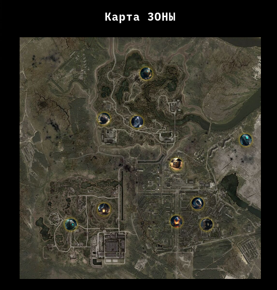

# Зов аномалий

Из условия задания следует, что главная задача - найти все аномалии в зоне. Переходим на сайт и видим карту. 



Просмотрев все аномалии так и не находим флаг, скорее всего, на карте представлены не все аномалии. 
Переберем всевозможные ID с помощью wfuzz, и выясним, так ли это на самом деле

```bash
$ wfuzz -z range,1-300 --hc 404 https://its-artifacts-jk2dm72.spbctf.ru/?attachment_id=FUZZ

********************************************************
* Wfuzz 3.1.0 - The Web Fuzzer                         *
********************************************************

Target: https://its-artifacts-jk2dm72.spbctf.ru/?attachment_id=FUZZ
Total requests: 300

=====================================================================
ID           Response   Lines    Word       Chars       Payload                                                                                                 
=====================================================================

000000026:   200        187 L    1829 W     43168 Ch    "26"                                                                                                    
000000020:   200        187 L    1825 W     42975 Ch    "20"                                                                                                    
000000064:   200        187 L    1815 W     42615 Ch    "64"                                                                                                    
000000091:   200        187 L    1827 W     43024 Ch    "91"                                                                                                    
000000113:   200        186 L    1815 W     42782 Ch    "113"                                                                                                   
000000115:   200        186 L    1815 W     42779 Ch    "115"                                                                                                   
000000112:   200        186 L    1815 W     42764 Ch    "112"                                                                                                   
000000114:   200        186 L    1815 W     42776 Ch    "114"                                                                                                   
000000111:   200        186 L    1815 W     42764 Ch    "111"                                                                                                   
000000118:   200        186 L    1815 W     42776 Ch    "118"                                                                                                   
000000116:   200        186 L    1815 W     42764 Ch    "116"                                                                                                   
000000117:   200        186 L    1815 W     42779 Ch    "117"                                                                                                   
000000120:   200        186 L    1815 W     42770 Ch    "120"                                                                                                   
000000119:   200        186 L    1815 W     42767 Ch    "119"                                                                                                   
000000191:   200        186 L    1812 W     42633 Ch    "191"
```

Так и есть, под аномалией с ID=191 скрывается флаг


