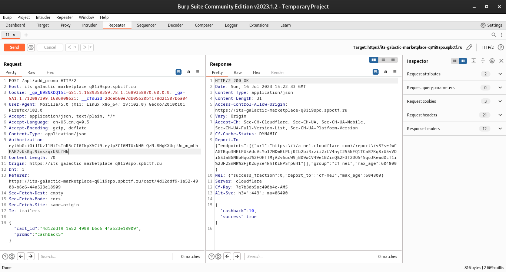
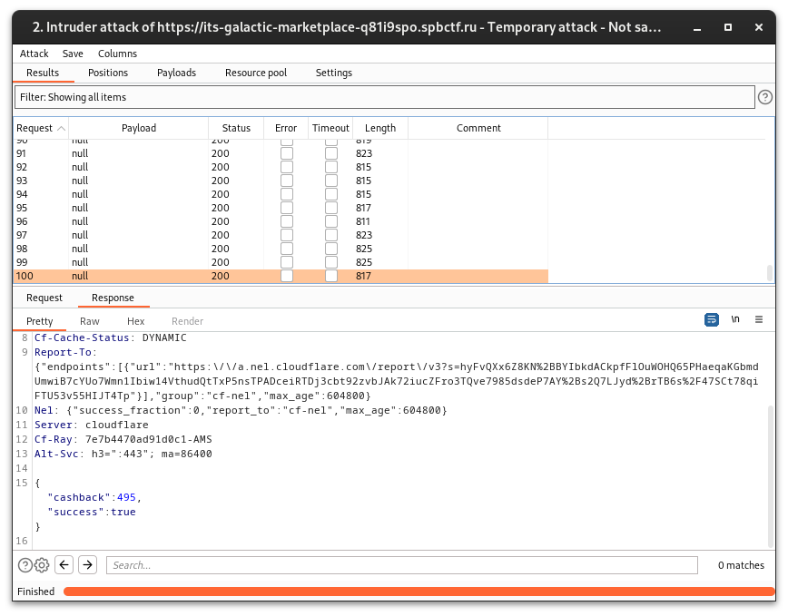
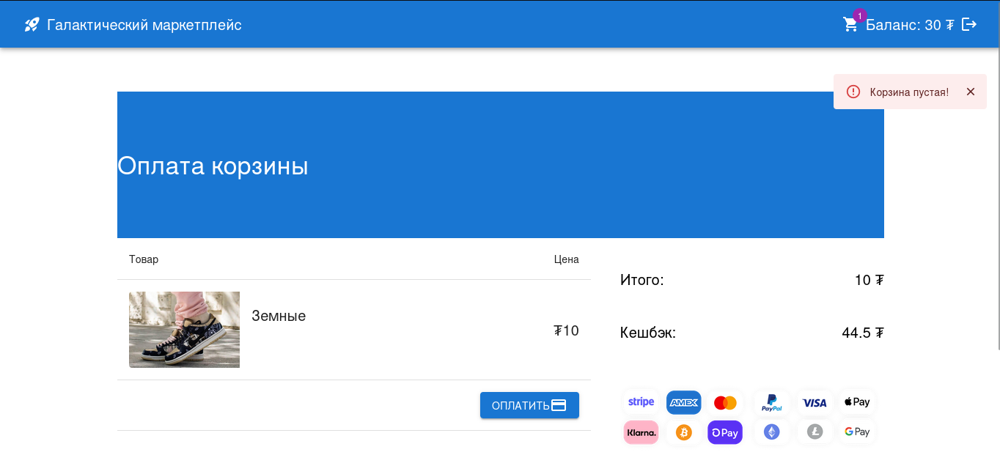
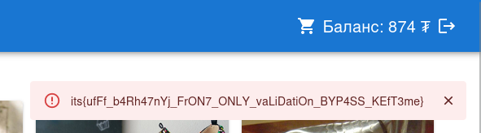

# Кефтеме

Потыкаем сайт и посмотрим, что происходит в Burp'е.  
Для активации промокода на кэшбэк (о котором сказано в условии), на сервер отправляется запрос:

Фронтенд не позволяет нам активировать промокод еще раз, но мы попробуем сделать это в Repeater'е Burp'а:

Как не странно, но это работает. Повторим этот запрос еще много раз, чтобы *cashback* стал больше 100 и мы ушли в плюс после покупки:

Теперь можно купить товары подороже. Повторим действия выше... 
После нескольких итераций мы смогли накопить нужную сумму для покупки "Подкрадулей флажных":

