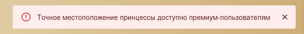
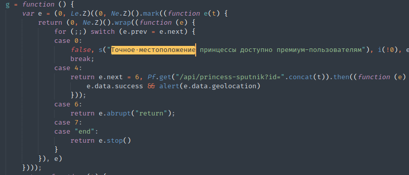

# Принцесса в другом замке

После того как выбрали нашу принцессу и досвайпали до конца, пробуем купить информацию об ее метсоположении, но  получаем:



Во вкладке браузера *Network* ничего не происходит, поэтому начнем анализ кода React'а. Чуть упростим его с помощью [de4js](https://lelinhtinh.github.io/de4js/) и выполним ключевой поиск по тому самому сообщению:



Чуть ниже видим обращение к API. Вызовем его с идентификатором нашей принцессы:


```bash
$ curl https://its-tinderella-wyfklpp1.spbctf.ru/api/princess-sputnik?id=2                       
{"geolocation":"its{Its_a_mE_MarIO_FOUnd_a_vulN_4ND_FoUnD_My_loV3}","success":true}
```